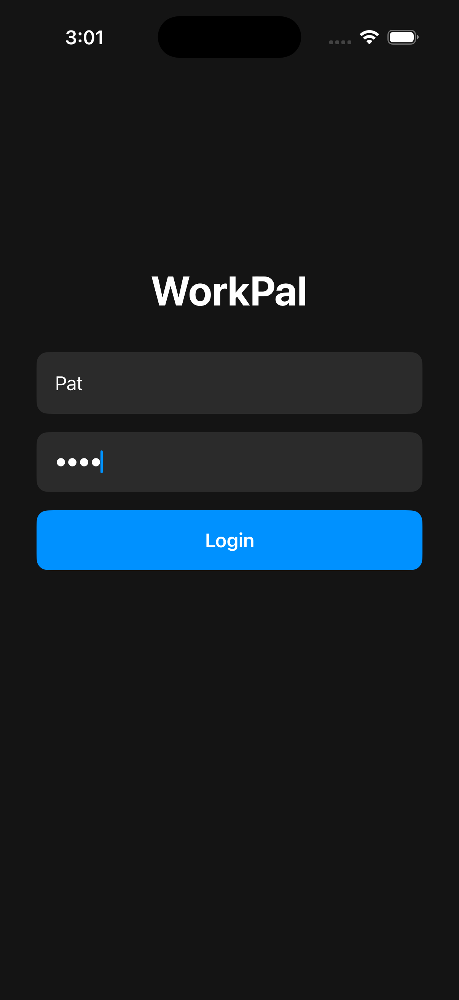
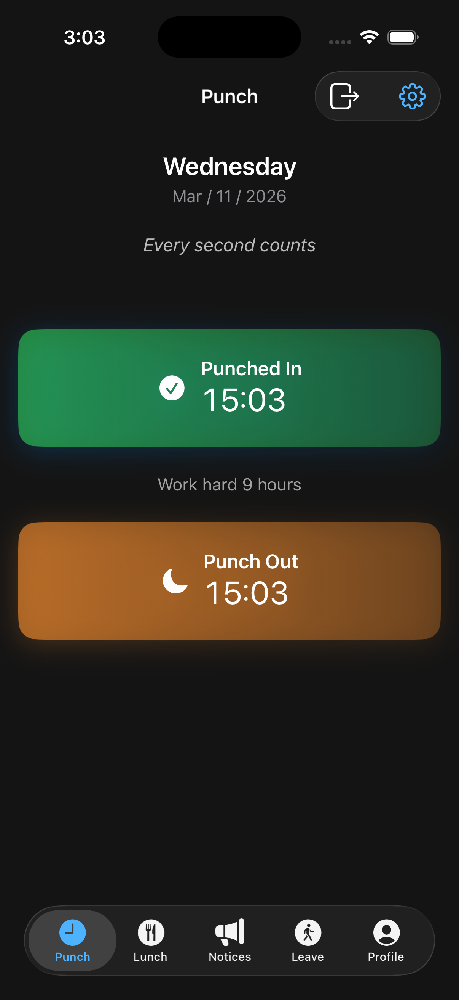
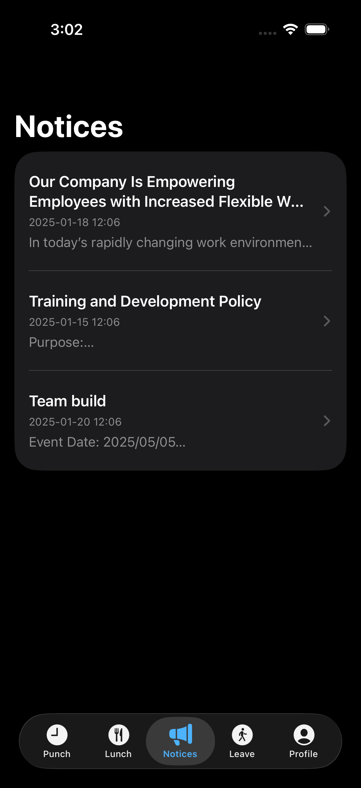
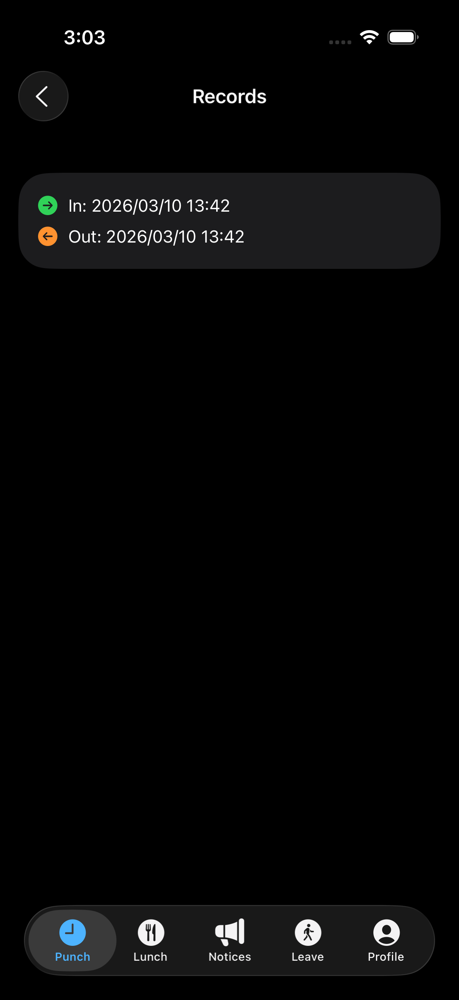
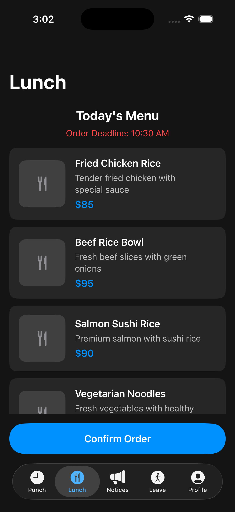
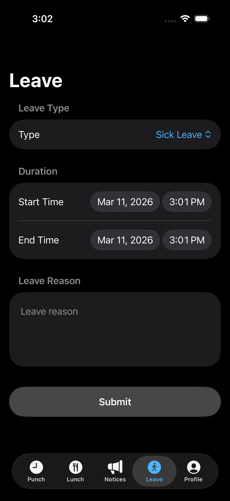
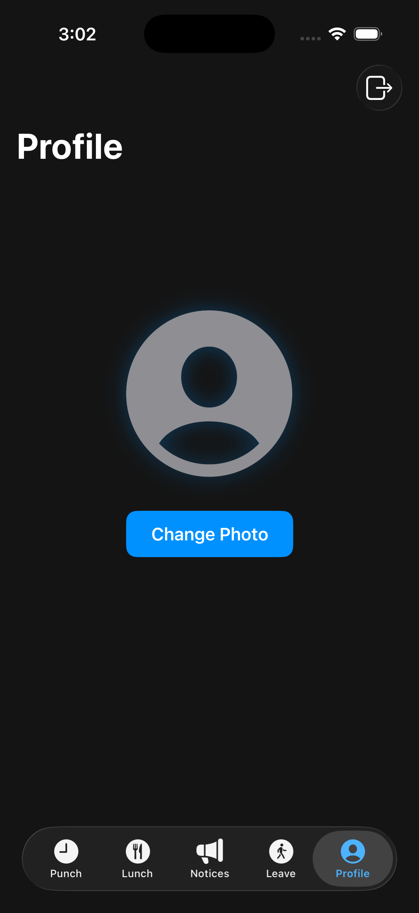

# WorkPal — UIKit → SwiftUI 
> iOS 16+　|　SwiftUI　|　Unit Testable

---

## 專案概述

WorkPal 是一個示範如何將 UIKit 專案系統性遷移至 SwiftUI 的模板專案，採用 **MVVM 架構**，所有業務邏輯皆可獨立進行 Unit Test，不依賴任何 UI 框架。

---

## 功能截圖

|                                                                     |                                                                 |                                                                    |
| ------------------------------------------------------------------- | --------------------------------------------------------------- | ------------------------------------------------------------------ |
| **登入**<br>           | **打卡**<br> | **佈告欄**<br> |
| **紀錄列表**<br> | **訂餐**<br> | **請假**<br>     |
| **個人**<br>         |                                                                 |                                                                    |


---

## 資料夾結構

```
WorkPal/
├── App/
│   ├── WorkPalApp.swift              # @main（取代 AppDelegate + SceneDelegate）
│   └── RootView.swift                # 登入狀態驅動根視圖切換
│
├── Features/
│   ├── Login/
│   │   ├── ViewModels/LoginViewModel.swift          ← CompanyAppLoginVC
│   │   └── Views/LoginView.swift
│   ├── Main/
│   │   └── Views/MainTabView.swift                  ← MainTabBarViewController
│   ├── PunchClock/
│   │   ├── ViewModels/PunchClockSwiftUIViewModel.swift  ← PunchClockViewModel（移除 UIKit）
│   │   └── Views/PunchClockView.swift               ← PunchClockViewController
│   ├── NoticeBoard/
│   │   ├── Models/NoticeBoardItem.swift             ← NoticeBoard（+Identifiable）
│   │   ├── ViewModels/NoticeBoardViewModel.swift
│   │   └── Views/NoticeBoardView.swift + DetailView ← NoticeBoardVC + DetailVC
│   ├── RecordList/
│   │   ├── ViewModels/RecordListViewModel.swift
│   │   └── Views/RecordListView.swift               ← RecordListViewController
│   ├── OrderLunch/
│   │   ├── Models/MenuItemModel.swift               ← MenuItem（+Identifiable）
│   │   ├── ViewModels/OrderLunchViewModel.swift
│   │   └── Views/OrderLunchView.swift               ← OrderLunchViewController
│   ├── TakeLeave/
│   │   ├── Models/LeaveRequest.swift                ← LeaveType enum
│   │   ├── ViewModels/TakeLeaveViewModel.swift
│   │   └── Views/TakeLeaveView.swift                ← TakeLeaveViewController
│   ├── Profile/
│   │   ├── ViewModels/ProfileViewModel.swift
│   │   └── Views/ProfileView.swift                  ← ProfilesViewController
│   └── Setting/
│       ├── ViewModels/SettingSwiftUIViewModel.swift  ← SettingViewModel（移除 UIKit）
│       └── Views/SettingView.swift                   ← SettingViewController
│
├── Core/
│   ├── Managers/
│   │   ├── DataManagerProtocol.swift    # CompanyDataManger 轉接 + Mock
│   │   ├── PunchStateManager.swift      # UserDefaultManager 轉接 + Mock
│   │   └── JSONLoader.swift             # JSONUtils 轉接 + Mock
│   ├── Models/
│   │   ├── PunchRecord.swift            ← TimeRecord（+Identifiable）
│   │   └── QuoteItem.swift              ← Quote
│   ├── Extensions/
│   │   └── View+Extensions.swift
│   └── Utilities/
│       └── DateFormatter+Utilities.swift
│
├── CompanyApp/                          # 原始 UIKit 代碼（保留參考）
│
└── Resources/

WorkPalTests/Features/
├── Login/LoginViewModelTests.swift
├── PunchClock/PunchClockViewModelTests.swift
├── NoticeBoard/NoticeBoardViewModelTests.swift
├── OrderLunch/OrderLunchViewModelTests.swift
├── TakeLeave/TakeLeaveViewModelTests.swift
└── Setting/SettingViewModelTests.swift
```

---

## UIKit → SwiftUI 對應表

| UIKit 概念                         | SwiftUI 對應                           | 說明                                               |
| ---------------------------------- | -------------------------------------- | -------------------------------------------------- |
| `UIViewController`                 | `View` + `ViewModel`                   | 強制 MVVM，邏輯移入 ViewModel                      |
| `UITableView` / `UICollectionView` | `List` / `LazyVGrid`                   | 搭配 `Identifiable` 協議                           |
| `UIStackView`                      | `HStack` / `VStack`                    | 注意 `alignment` 與 `spacing` 參數對應             |
| `NSLayoutConstraint`               | `.frame()` / `.padding()` / `Spacer()` | 優先彈性空間，避免固定尺寸                         |
| `UIView.isHidden`                  | `@Published var isHidden` + 條件渲染   | `.hidden(_ bool)` extension                        |
| `UIView.animate`                   | `withAnimation { }`                    | 聲明式，非命令式                                   |
| `UIActivityIndicatorView`          | `ProgressView` + `.loadingOverlay`     | 封裝成 ViewModifier                                |
| `UIAlertController`                | `.alert` modifier                      | 封裝成 `.errorAlert` extension                     |
| `UISearchController`               | `.searchable` modifier                 | 直接掛在 NavigationStack                           |
| `UIRefreshControl`                 | `.refreshable` modifier                | async/await 原生支援                               |
| `viewDidLoad`                      | `.task { }` / `.onAppear`              | `.task` 支援 async，優先使用                       |
| `viewWillAppear`                   | `.onAppear`                            | 每次出現皆觸發                                     |
| `Delegate Pattern`                 | `Binding` / 閉包 (Closure)             | 單向資料流，避免 delegate 循環                     |
| `NotificationCenter`               | `.onReceive`                           | 在 View 層直接監聽                                 |
| `UIStoryboard` / `XIB`             | `View` 結構體                          | 完全用 Swift DSL，無 XML                           |
| `prepare(for:sender:)`             | 直接傳遞 `ViewModel` 或資料            | `NavigationLink(value:)` + `navigationDestination` |
| `pushViewController`               | `NavigationLink` / `NavigationStack`   | 型別安全路由                                       |
| `present`                          | `.sheet` / `.fullScreenCover`          | 聲明式呈現                                         |
| `IBAction`                         | 直接呼叫 ViewModel 的 Intent 方法      | 無 `@IBAction`                                     |
| `@IBOutlet`                        | `@Published` 狀態                      | View 自動響應，無需手動更新                        |
| `UIAppearance`                     | `.environment` / `.tint` modifier      | 全域樣式設定                                       |

---

## Unit Test 

```swift
// ✅ 好：依賴 Protocol，可注入 Mock
final class TaskListViewModel: ObservableObject {
    init(service: TaskServiceProtocol) { ... }
}

// ❌ 壞：直接依賴具體實作，無法測試
final class TaskListViewModel: ObservableObject {
    let service = TaskService()
}
```

### Mock 注入範例

```swift
// Unit Test 中使用 Mock
let mockService = MockTaskService()
mockService.mockTasks = [TaskItem(title: "Test")]
let viewModel = TaskListViewModel(service: mockService)

// 模擬錯誤
mockService.shouldThrowError = true
mockService.mockError = .serverError(statusCode: 500)
```

### 測試覆蓋範圍

| 層級      | 測試項目                                                  |
| --------- | --------------------------------------------------------- |
| Model     | Computed properties、Codable、Equatable                   |
| ViewModel | 所有 Intent 方法、狀態變更、錯誤處理、Computed properties |
| Service   | 使用 Mock HTTPClient 測試路由正確性                       |

---

## 新增功能流程

1. `Features/{FeatureName}/Models/{Name}Item.swift` — 資料模型
2. `Features/{FeatureName}/Models/{Name}Service.swift` — Service Protocol + Mock
3. `Features/{FeatureName}/ViewModels/{Name}ViewModel.swift` — 業務邏輯
4. `Features/{FeatureName}/Views/{Name}View.swift` — UI
5. `WorkPalTests/Features/{FeatureName}/{Name}ViewModelTests.swift` — 測試

並在 `Core/DI/AppContainer.swift` 中新增對應的 factory 方法。

---

## 遷移現有 UIKit 代碼步驟

1. **識別業務邏輯** — 找出 `UIViewController` 中的非 UI 代碼
2. **建立 ViewModel** — 將邏輯搬至 `ObservableObject`
3. **定義狀態** — 將 UI 屬性轉為 `@Published`
4. **抽取 Service** — 將網路請求移至 Protocol-based Service
5. **改寫 UI** — 使用對應表改寫佈局
6. **寫測試** — 針對 ViewModel 和 Model 補上 XCTest

---

## 檔案對應總表（UIKit → SwiftUI）

| 原始 UIKit 檔案                                          | SwiftUI 檔案                                                  | 轉換重點                                |
| -------------------------------------------------------- | ------------------------------------------------------------- | --------------------------------------- |
| `AppDelegate.swift` + `SceneDelegate.swift`              | `App/WorkPalApp.swift`                                        | @main App，移除 UIWindow                |
| `CompanyAppLoginVC.swift`                                | `Login/LoginView.swift` + `LoginViewModel.swift`              | TextField delegate → @Published binding |
| `MainTabBarViewController.swift`                         | `Main/MainTabView.swift`                                      | UITabBarController → TabView            |
| `PunchClockViewController.swift`                         | `PunchClock/PunchClockView.swift`                             | CAEmitterLayer → withAnimation          |
| `PunchClockViewModel.swift`                              | `PunchClock/PunchClockSwiftUIViewModel.swift`                 | 移除 UILabel/UIButton，純 Foundation    |
| `NoticeBoardViewController.swift`                        | `NoticeBoard/NoticeBoardView.swift`                           | UITableView → List                      |
| `NoticeBoardDetailViewController.swift`                  | `NoticeBoard/NoticeBoardDetailView.swift`                     | init(detail:) → 直接傳入 struct         |
| `RecordListViewController.swift`                         | `RecordList/RecordListView.swift`                             | callback → async/await                  |
| `OrderLunchViewController.swift` + `MenuItemCell`        | `OrderLunch/OrderLunchView.swift`                             | UITableViewCell → SwiftUI Row           |
| `TakeLeaveViewController.swift`                          | `TakeLeave/TakeLeaveView.swift`                               | MyPicker delegate → Picker binding      |
| `ProfilesViewController.swift`                           | `Profile/ProfileView.swift`                                   | UIImagePickerController → PhotosPicker  |
| `SettingViewController.swift` + `SettingViewModel.swift` | `Setting/SettingView.swift` + `SettingSwiftUIViewModel.swift` | Combine assign → @Published             |

---

## 環境需求

- Xcode 15+
- iOS 16.0+
- Swift 5.9+
